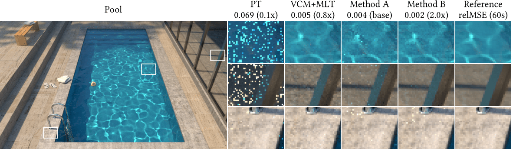
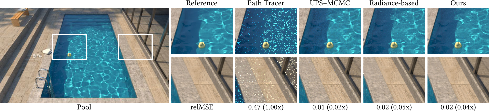
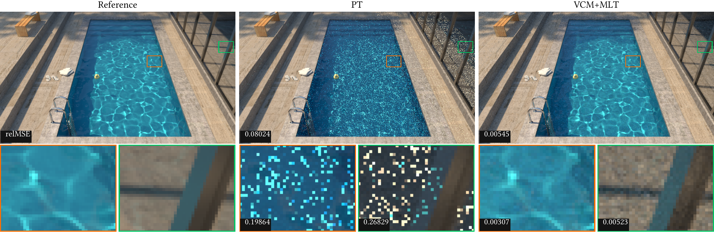
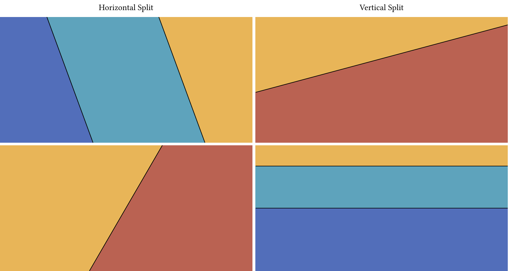
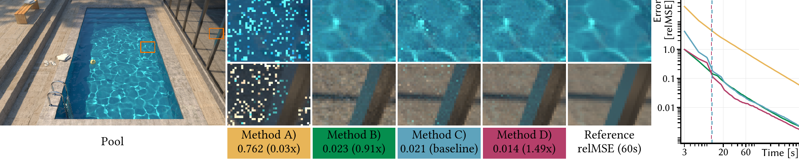
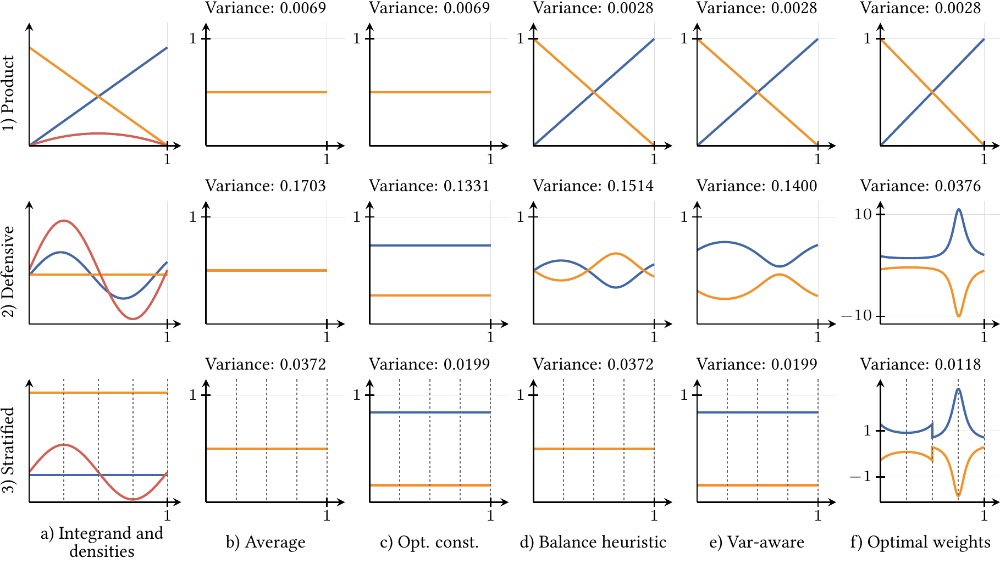
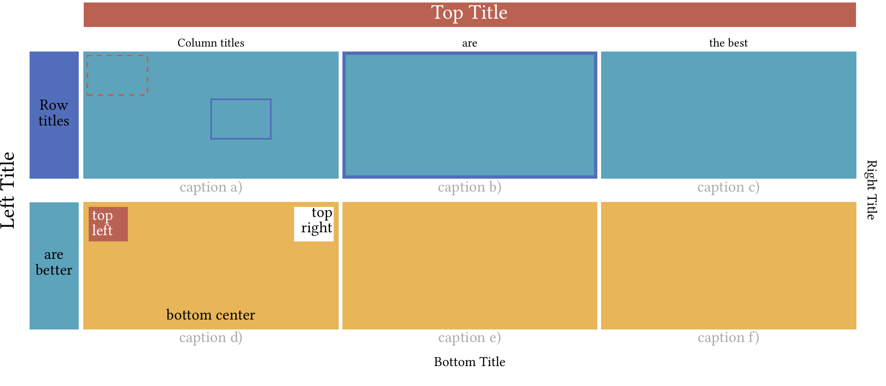

# Figure Generator

This is an awesome figure generator. It generates figures in pdf-, html- and pptx-format.
The following image shows the output of one of our test files ("tests/pool.py"):


This tool might help not only to create final figures, but also to analyze images faster: We offer a bunch of error metrics that allows not only to compare images visually but also mathematically.

Why did we create a figure generator?

In rendering research, it is quite common to create figures of "comparison"-type. Meaning, that we start with a set of generated images, that needs to be compared. Often, one rendered scene is not enough, therefore, we need several comparison figures - preferably in a similar or same style as the other created figures.

We support _grids_ (images that are grid-like arranged) and simple _line-plotting_. To get a further understanding what _grids_ are, you might want to have a look at our tutorial ([Tutorial.ipynb](Tutorial.ipynb)).

## Dependencies

Mandatory:
- Python 3.11+ with opencv-python, simpleimageio, and texsnip

Optional:
- For the .pdf backend: pdflatex (in path) with at least: tikz, calc, standalone, fontenc, libertine, inputenc.
- For the .pptx backend: python-pptx
- To include pdf files as image data: PyPDF2, and pdf2image ([which requires poppler](https://pypi.org/project/pdf2image/)).

## Quickstart

You can install the figure generator and all mandatory dependencies with a simple:

```
python -m pip install figuregen
```

The fastest way to get a first figure is by using an existing template:

```Python
import simpleimageio as sio
import figuregen
from figuregen.util.templates import CropComparison
from figuregen.util.image import Cropbox

figure = CropComparison(
    reference_image=sio.read("images/pool/pool.exr"),
    method_images=[
        sio.read("images/pool/pool-60s-path.exr"),
        sio.read("images/pool/pool-60s-upsmcmc.exr"),
        sio.read("images/pool/pool-60s-radiance.exr"),
        sio.read("images/pool/pool-60s-full.exr"),
    ],
    crops=[
        Cropbox(top=100, left=200, height=96, width=128, scale=5),
        Cropbox(top=100, left=450, height=96, width=128, scale=5),
    ],
    scene_name="Pool",
    method_names=["Reference", "Path Tracer", "UPS+MCMC", "Radiance-based", "Ours"]
)

# here you can modify the figure layout and data
# ...

# Generate the figure with the pdflatex backend and default settings
figuregen.figure([figure.figure_row], width_cm=17.7, filename="pool_with_template.pdf")
```


The template simply creates a list of `Grid` objects that can be modified and extended arbitrarily before passing it to the `figure()` function.

Examples and inspiration for creating your own figure layouts can be found in [our examples](examples) or the [Jupyter tutorial](Tutorial.ipynb).

## Examples

Clicking on an image below leads to the test that created the corresponding figure.

### Vertical stacks
[](examples/vertical_stack.py)

### Split Comparison
[](examples/split_comparison.py)

### Crop Comparison
[](examples/siggraph_example.py)

### Plots
[](examples/plotgrid.py)

### Grid with titles, labels, markers, and frames
[](examples/single_module.py)
